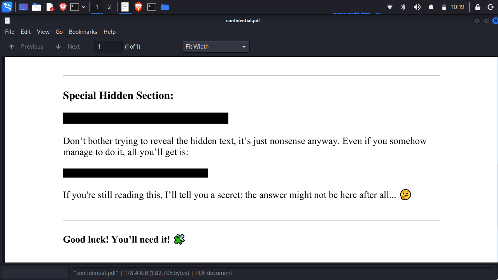

Cracking the Riddle: picoCTF Riddle Registry Walkthrough
========================================================

Welcome back, fellow hackers! Today we're diving into a **picoCTF** challenge from the Forensics category: **Riddle Registry**. This challenge is a classic example of how "hidden" data isn't always buried in complex code---sometimes it's right in the metadata of the files we use every day.

The Challenge
-------------

**Challenge Link:** [picoCTF - Riddle Registry](https://play.picoctf.org/practice/challenge/530?page=1&tag=63)

**Category:** Forensics

**Description:** We are given a mysterious PDF file that seems to contain nothing but garbled text. The hint tells us to look beyond the surface and "uncover the flag within the metadata."


* * * * *

Step 1: Initial Investigation
-----------------------------

Upon downloading and opening the file (often named `confidential.pdf`), you'll see a page full of nonsense characters. While some CTF challenges involve selecting "white-on-white" text or looking for hidden layers, the hint specifically points toward **metadata**.

Metadata is "data about data"---it includes information like the author of a document, the software used to create it, and the date it was modified.


* * * * *

Step 2: Extracting Metadata
---------------------------

There are several ways to view PDF metadata. You can use command-line tools like `exiftool` or online metadata viewers.

### Using Exiftool (Linux/Mac)

Open your terminal and run:

Bash

```
exiftool confidential.pdf

```

### What to Look For

When you run the command, a list of properties will appear (File Name, Directory, File Size, etc.). In this challenge, the **Author** field stands out. Instead of a name, it contains a strange string of characters ending in an `=` sign---a dead giveaway for **Base64 encoding**.

`Author : cGljb0NURntwdXp6bDNkX201dGFkYXRhX2YwdW5kIV80MjQ0MGM3ZH0=`

* * * * *

Step 3: Decoding the Flag
-------------------------

Now that we have the Base64 string, we just need to decode it to reveal the plain text.

1.  Copy the string: `cGljb0NURntwdXp6bDNkX201dGFkYXRhX2YwdW5kIV80MjQ0MGM3ZH0=`

2.  Use a terminal command or a tool like [CyberChef](https://gchq.github.io/CyberChef/).

**Using Terminal:**

Bash

```
echo "cGljb0NURntwdXp6bDNkX201dGFkYXRhX2YwdW5kIV80MjQ0MGM3ZH0=" | base64 -d
```
